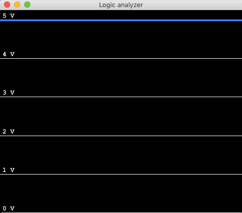

# arduino logical analyzer



## Usage

1. Download and install dependencies:

  ```
  git clone https://github.com/arve0/arduino_logical_analyzer
  cd arduino_logical_analyzer
  npm install
  ```

2. Flash arduino with contents of [`arduino.ino`](arduino/arduino.ino).
3. Find Arduino tty:

  ```
  ls /dev/tty.*
  ```

4. Start, replace `/dev/tty.usbserial-A900LEL7` with path to your Arduino:

  ```
  npm start -- /dev/tty.usbserial-A900LEL7
  ```
